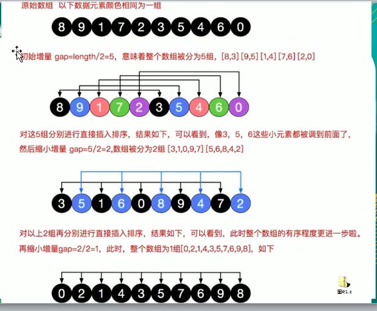
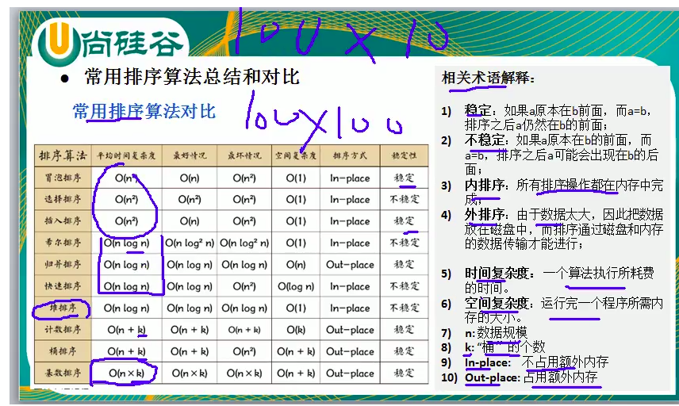

#  <center>排序算法</center>

<h5>排序算法的介绍</h5>

排序也称排序算法，排序是讲一组数据，依指定的顺序进行排列的过程

<h5>排序的分类</h5>

内部排序：

将要排序的数据加载到内存中进行排序

外部排序：

数据量过大，需要借助外部存储进行排序


​														内部排序：

  插入排序	 							选择排序							交换排序						归并排序							基数排序

直接插入排序、希尔排序		简单选择排序、堆排序	冒泡排序、快速排序		

**总共有8种，请牢记，铭记于心**

常见的实际复杂度分析：

 

 o(1)<o(log2n)<o(n)<(nlog2n)<o(n^2)<o(n^3)<o(n^k)<o(2^n)


冒泡排序：

思想：通过对待排序序列进行从前向后，**依次比较相邻元素的值**，若发现逆序就交换，使值较大的元素逐渐从前移向后部，就像水底下的气泡一样逐渐向上冒

实现超级简单：只要理解思想，ok，外层循环控制趟数，(n-1)躺，内层循环控制比较的次数第i躺，比较第n-i次

so,code:

```java
public static void sort(int[] array) {
	int temp=0;//定义一个临时交换变量
	boolean flag=false;//标志变量用来进行算法的优化。
	for(int i=0;i<array.length-1;i++) {
		for(int j=0;j<array.length-i-1;j++) {
			if(array[j]>array[j+1]) {
				//如果进行了交换，将标志变量变true;
				flag=true;
				temp=array[j];
				array[j]=array[j+1];
				array[j+1]=temp;
			}
		}
	}
}
```

优化，你发现没，如果第i躺有序，不进行交换，那么i+1后面的趟数都有序，完全没有交换的意义，增加一个标志变量，判断当前趟数是否进行交换了。还是有点小思路，flag代表是否进行交换了，如果交换了为true,没有交换为false,每次重置，不要影响下一次结果。

```java
public static void sort(int[] array) {
	int temp=0;//定义一个临时交换变量
	boolean flag=false;//标志变量用来进行算法的优化。
	for(int i=0;i<array.length-1;i++) {
		for(int j=0;j<array.length-i-1;j++) {
			if(array[j]>array[j+1]) {
				//如果进行了交换，将标志变量变true;
				flag=true;
				temp=array[j];
				array[j]=array[j+1];
				array[j+1]=temp;
			}
		}
		if(!flag) {
			break;
		}else {
			//将标志重置，防止影响下一趟的结果，如果下一趟不比较的话，就变成了true，那么就不退出了
			flag=false;
		}
	}
}	
```

选择排序：

从戴排序元素的中第一次选出第一个最小的数放在第一个位置，第二次选择第二个最小的数，第三次选择第三个最小的数，第四次选择第四个最小的数，知道选出n-1个最小的数，说明排序完成

```java
	public static void sort(int []array) {
		int temp=0;
		for(int i=0;i<array.length-1;i++) {
			//记录最小位置的下标，默认从第i个开始
			int minNum=i;
			for(int j=i+1;j<array.length;j++) {
				if(array[j]<array[minNum]) {
					minNum=j;
				}
			}
			//优化
			if(minNum!=i) {
			temp=array[i];
			array[i]=array[minNum];
			array[minNum]=temp;}
			
		}
	}

```

插入排序：

简单插入排序：

假定待排序数组分为有序的和无序的两部分，将无序的要出入的数据依次插入有序列表的合适位置，深入理解多画图，精髓

```java
package sort;

import java.util.Arrays;

public class InsertionSort {

	public static void main(String[] args) {
	  int array[]= {9,8,7,6,5,4,3,2,1};
	  sort(array);
	  System.out.println(Arrays.toString(array));
   }
	public static void sort(int [] array) {
		//假设第一个元素就是有序，不，他就是有序的嘛
//		for(int i=1;i<array.length;i++) {
//			//定义待插入的数
//			int insertVal=array[i];
//			int insertIndex=i-1;//定义待插入的索引位置
//			while(insertIndex>=0&&insertVal<array[insertIndex]) {
//				//说明还没有找到待插入数据的位置,因此，后移
//				array[insertIndex+1]=array[insertIndex];
//				insertIndex--;
//			}
//			//不在while循环当中就说明找到了insertVal>array[insertIndex],说明找到要插入的位置了
//			  array[insertIndex+1]=insertVal;
//		}
		for(int i=1;i<array.length;i++) {
			int insertVal=array[i]; 
			int j=i-1;
			for(;j>=0&&(insertVal<array[j]);j--) {
				array[j+1]=array[j];
                //j的值-1
			}
			//不在for循环内说明j<0或者是找到位置了，即indexVal>array[j]，插到j后面，因为每次没找到合适的时候已经后移了，所以直接进去Ok,j的
            //优化,j+1如果等于i的话，说明，要插入的位置就是当前i的位置，可以优化
            if(j+1!=i){
			array[j+1]=insertVal;
            }
		}
	}
}

```

希尔排序：是对简单插入排序的优化，希尔排序是把记录按下标的一定增量分组，对每组使用直接插入排序算法排序；随着增量逐渐减少，每组包含的关键词越来越多，当增量减至1时，整个文件恰被分成一组，算法便终止



我的理解：其实希尔排序很好理解：就是按照不同的步长进行分组，对分组进行插入排序，只不过插入排序的步长是1.注意：我这里用的是移位法，而不是交换法，交换太慢了。

```java
package datastructure;

import java.util.Arrays;

public class ShellSort {

public static void main(String[] args) {
    int array[]={9,8,7,6,5,4,3,2,1};
    sort(array);
    System.out.println(Arrays.toString(array));

}
public static void sort(int[] array){
   for(int step=array.length/2;step>0;step/=2){
       for(int i=step;i<array.length;i++){
           int temp=array[i];
           int j=i-step;
           for(;j>=0&&temp<array[j];j-=step){
               array[j+step]=array[j];
           }
           if(j+step!=i){
                array[j+step]=temp;
           }
       }
   } 
}
}

```

快速排序：是冒泡排序的升级版，属于交换排序的一种

思路：就是选定一个数作为provit(中轴)，进行partition分割，返回中轴的索引，再进行左边partition分割和右边partition分割，递归实现，就是快排，快排还是挺不好理解的，好好琢磨，包括现在的我，也只是理解了皮毛而已，我对里面的每一次partition已经理解透了，就是中轴所在值不断与后面的high指针的值比较，移动与前面的left指针的值，比较移动，终于排完后，返回中轴值处的索引，再对中轴前面的数据和和后面的数据分别分割即递归调用quickSort函数

```
package sort;

import java.util.Arrays;

public class QuickSort {

	public static void main(String[] args) {
		// TODO Auto-generated method stub
		int []array= {1,-2,0,-2,9,8,5,6};
		quickSort(array, 0, array.length-1);
		System.out.println(Arrays.toString(array));

	}
	public static void quickSort(int[] array,int low,int high) {
		int pivot=0;
		if(low<high) {
		   pivot=partition(array, low, high);
		   quickSort(array,low,pivot-1);
		   quickSort(array,pivot+1,high);
		}
	}
	public static int partition(int[]array,int low,int high) {
		int temp=0;
		int mid=low+(high-low)/2;
		if(array[low]>array[high]) {
			temp=array[low];
			array[low]=array[high];
			array[high]=temp;
		}
		if(array[mid]>array[high]) {
			temp=array[mid];
			array[mid]=array[high];
			array[high]=temp;
		}
		if(array[low]<array[mid]) {
			temp=array[mid];
			array[mid]=array[low];
			array[low]=temp;
		}
	System.out.println("mid"+array[mid]);
	System.out.println("low"+array[low]);
	System.out.println("high"+array[high]);
		int pivotkey=array[low];
		while(low<high&&array[high]>=pivotkey) {
			high--;
		}
		temp=array[low];
		array[low]=array[high];
		array[high]=temp;
		while(low<high&&array[low]<=pivotkey) {
	         low++;	
		}
		temp=array[low];
		array[low]=array[high];
		array[high]=temp;
		
	  return low;	
	}

}

```

快速排序优化，三数去中，由于递归次数太多引起的栈溢出问题，简化递归次数

```java
package sort;

import java.text.SimpleDateFormat;
import java.util.Arrays;
import java.util.Date;

public class QuickSort {

	public static void main(String[] args) {
		// TODO Auto-generated method stub
//		int []array= {1,-2,0,-2,9,8,5,6};
//		quickSort(array, 0, array.length-1);
//		System.out.println(Arrays.toString(array));
		int []array= new int[8000000];
		for(int i=0;i<8000000;i++) {
			array[i]=(int)(Math.random()*8000000);
		}
		Date date1=new Date();
		SimpleDateFormat sdf=new SimpleDateFormat("yyyy-MM-dd:hh:mm:ss");
		System.out.println(sdf.format(date1));
		quickSort(array,0,array.length-1);
		Date date2=new Date();
		System.out.println(sdf.format(date2));

	}
	public static void quickSort(int[] array,int low,int high) {
		int pivot=0;
		if(low<high) {
		   pivot=partition(array, low, high);
		   quickSort(array,low,pivot-1);
            //优化，减少栈的深度
		   low=pivot+1;
		  
		}
	}
	public static int partition(int[]array,int low,int high) {
		int temp=0;
		int mid=low+(high-low)/2;
		if(array[low]>array[high]) {
			temp=array[low];
			array[low]=array[high];
			array[high]=temp;
		}
		if(array[mid]>array[high]) {
			temp=array[mid];
			array[mid]=array[high];
			array[high]=temp;
		}
		if(array[low]<array[mid]) {
			temp=array[mid];
			array[mid]=array[low];
			array[low]=temp;
		}
		int pivotkey=array[low];
        while(low<high){
		while(low<high&&array[high]>=pivotkey) {
			high--;
		}
		temp=array[low];
		array[low]=array[high];
		array[high]=temp;
		while(low<high&&array[low]<=pivotkey) {
	         low++;	
		}
		temp=array[low];
		array[low]=array[high];
		array[high]=temp;
        }
	  return low;	
	}

}

```

可能我真的比较笨，我看不懂韩顺平老师的代码，这是看了大话数据结构才看懂的，仍然不太完全懂，但是写代码和优化没问题，我只是觉得快排太牛逼了，虽然他不稳定但是他在处理800万个数据在栈没有溢出的情况下只用了6s，可能我的优化不好，我的快排没有希尔块，哈哈，我觉得是中轴数选取的问题。

归并排序：是利用归并的思想实现的排序方法，该算法采用经典的分治(divide-and-conquer)策略(分治法讲问题**分**成一些小的问题后递归求解，而**治**的阶段则将分的阶段得到的各答案"修补在一起"，即分而治之)

分而治之：递归实现：

```java
package sort;
import java.text.SimpleDateFormat;
import java.util.Arrays;
import java.util.Date;
public class MergeSort {
	/**
	 * @author lcy
	 * @param args
	 * @return void
	 */
	public static void main(String[] args) {
		int []array= {1,2,2,2,2,0,0,0,1,1};
		int []temp=new int[array.length];
		mSort(array,temp, 0, array.length-1);
		System.out.println(Arrays.toString(array));
//		int array[]=new int[80000];
//		for(int i=0;i<80000;i++) {
//			array[i]=(int)(Math.random()*80000);
//		}
//		Date date1=new Date();
//		SimpleDateFormat sdf=new SimpleDateFormat("yyyy-MM-dd:hh:mm:ss");
//		System.out.println(sdf.format(date1));
//		mSort(array,array,0,array.length-1);
//		Date date2=new Date();
//		System.out.println(sdf.format(date2));
	}
	//将无序的数组分组并排序合并到新的数组中
	public static void mSort(int sR[],int tR1[],int s,int t) {
		int m;
		int tR2[]=new int[sR.length];
		if(s==t) tR1[s]=sR[s];//说明已经到不能再分的地步了
		else {
			m=(s+t)/2;
			//tR2原来为空
			mSort(sR,tR2,s,m);//递归将sR[s...m]归并到有序的tR2[s...m]
			mSort(sR,tR2,m+1,t);//递归讲sR[m+1,t]归并到有序的tR2[m+1..t]
			merge(tR2,tR1,s,m,t);//将tR2[s..m]和tR2[m+1..t]归并到tR1[s..t]
		}
	}
	public static void merge(int sR[],int tR[],int i,int m,int n) {

		int j,k,l;
		//有序合并两个不同的数组，很重要，就是治的实现
		for(j=m+1,k=i;i<=m&&j<=n;k++) {
			if(sR[i]<sR[j]) tR[k]=sR[i++];
			else tR[k]=sR[j++];
		}
		//将剩下的复制到tR数组中
		if(i<=m) {
			for(l=0;l<=m-i;l++) {
				tR[k+l]=sR[i+l];
			}
		}
		if(j<=n) {
			for(l=0;l<=n-j;l++) {
				tR[k+l]=sR[j+l];
			}
		}
	}

}

```

还是挺不好理解的。

空间换时间的排序：不是基于比较的排序

基数排序：桶排序的升级，多关键字排序，字面理解挺好理解的，标准的空间换时间

思路：用0-9个桶来装对应数组的数据，一个一维数组来表示每个桶内的数据个数，通过对个位数比较排序，在通过十位数比较排序，百位依次类推。

```java
public static void radixSort(int []array) {
		//定义一个二维数组，表示10个桶
		int [][] bucket=new int[10][array.length];
		//为记录每个桶的数据，需要一个一维数组来记录,bucketElementCounts[0],记录的就是bucket[0]桶放入的数据个数
		int[] bucketElementCounts=new int[10];
		int maxIndex=0;
		//得到最大的那个数并获取最大位数有多少位数
		for(int i=0;i<array.length;i++) {
			if(array[maxIndex]<array[i]) {
				maxIndex=i;
			}
		}
		int maxNum=(array[maxIndex]+"").length();
	for(int i=0,n=1;i<maxNum;i++,n*=10) {
		//根据轮数进行排序
		for(int j=0;j<array.length;j++) {
			//取出每个元素的个位数的值
			int digitOfElement=array[j]/n%10;
			//放入对应的桶中
			bucket[digitOfElement][bucketElementCounts[digitOfElement]++]=array[j];
		}
		//按照桶的顺序遍历每一个桶,放入原来的数组中
		int index=0;
		for(int k=0;k<bucket.length;k++) {
			if(bucketElementCounts[k]!=0) {//说明第k个桶内有数据
				//遍历有数据的桶
				for(int l=0;l<bucketElementCounts[k];l++) {
					array[index++]=bucket[k][l];
				}
				//将桶内的数据清零，下次还要使用
			bucketElementCounts[k]=0;
			}
			
		}
	 }
	}
```

以上是我目前学习的排序了，缺少一个堆排序我会补上的，我希望我可以每天把这些排序来一遍，加深印象和理解。




​				


